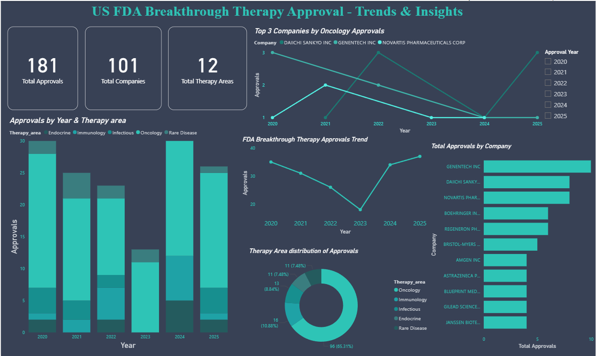

# FDA Breakthrough Therapy Approval Analysis (2020–2024)

## Project Overview
This project analyzes FDA Breakthrough Therapy drug approvals between 2020 and 2024 using Power BI.  
The dashboard examines therapy area distribution, annual approval trends, and leading pharmaceutical companies.

---

## Dashboard Preview

---

## Objective
To identify trends in breakthrough drug approvals and highlight dominant therapy areas and leading pharmaceutical contributors.

---

## Key Insights

- Total approvals (2020–2024): **144**
- Oncology consistently dominates breakthrough approvals across all five years.
- Approval volume declined from 2020 to 2023, followed by recovery in 2024.
- Genentech Inc. and Novartis Pharmaceuticals Corp. are the leading contributors.

---

## Key Visualizations

- Total Breakthrough Approvals KPI
- Annual Approval Trend
- Therapy Area Distribution
- Therapy Area Share by Year (100% Stacked Chart)
- Breakthrough Approvals by Company

---

## Tools Used

- Power BI
- Microsoft Excel (Data Cleaning)

---

## Files Included

- `Breakthrough therapy project.pbix` – Power BI dashboard file  
- `Breakthrough therapy analysis.xlsx` – Dataset used for analysis  

---

## Author

**Adithya Narayan R**  
M.Tech (Pharmaceutical Science & Engineering), IIT (ISM) Dhanbad  
Aspiring Business Analyst | Pharmaceutical & Healthcare Analytics
